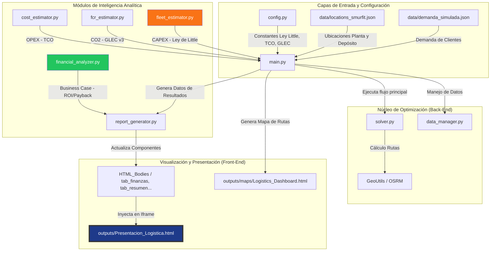

# 🗺️ Mapa de Arquitectura del Optimizador GABM-Project

Este documento explica cómo se interrelacionan los archivos del proyecto, desde el motor de cálculo hasta el Dashboard de presentación final.

---

## 📂 ¿Qué hace cada archivo clave?

| Archivo | Responsabilidad Principal | Impacto en la Presentación |
| :--- | :--- | :--- |
| **`config.py`** | El "Cerebro" de las constantes. Contiene los precios del diésel, costes de camiones, y los 1.2 días de ciclo. | Cambia los números de todas las pestañas. |
| **`main.py`** | La Orquesta. Coordina todas las llamadas, desde leer los datos hasta escribir los resultados finales. | Gestiona la ejecución de todo el proceso. |
| **`fleet_estimator.py`** | El Especialista en Inversión. Traduce la demanda operativa (λ) en número de camiones físicos usando la Ley de Little. | Define los **7.4M €** de inversión que ves. |
| **`financial_analyzer.py`** | El Financiero. Toma la inversión y los ahorros operativos para escupir el ROI y el tiempo de recuperación (Payback). | Alimenta la pestaña de **"Business Case"**. |
| **`report_generator.py`** | El "Maquetador". Es el encargado de coger los JSON de resultados y "dibujarlos" en los archivos HTML individuales. | Sin esto, la presentación no se actualizaría. |
| **`HTML_Bodies/`** | Son los fragmentos HTML de cada pestaña (Finanzas, Resultados, Mapa...). | Son las piezas de código que se cargan dentro del panel principal. |
| **`Presentacion_Logistica.html`** | El Marco Global. Es el archivo que abres en el navegador para ver todo el proyecto unificado. | Es tu cara al cliente/junta directiva. |

> [!NOTE]
> **Flujo de una actualización**: Cambias algo en `config.py` → Corres `main.py` → `report_generator.py` detecta el cambio → Actualiza `tab_finanzas.html` → Refrescas `Presentacion_Logistica.html` y ves el nuevo ROI.
