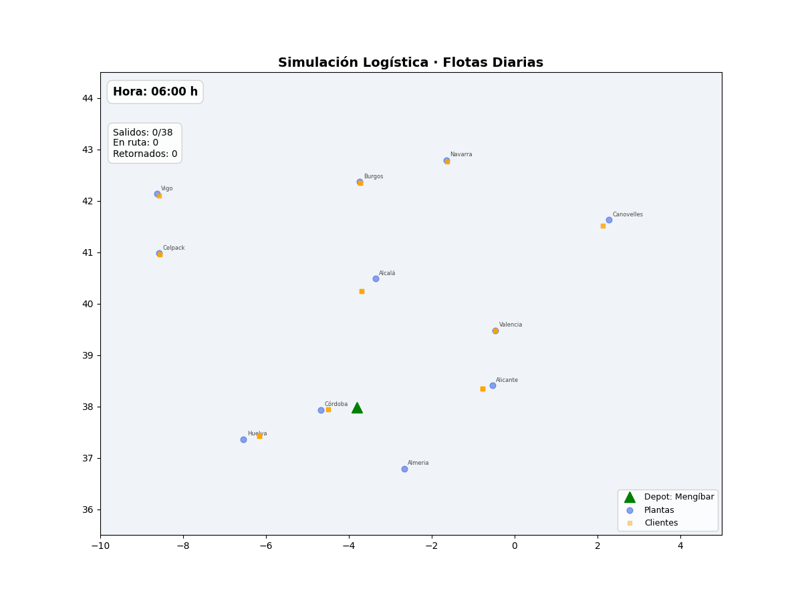

## Contexto y Visión {data-background-image="assets/bg_network.png"}

:::{.glass-panel}

### Pitch Técnico-Ejecutivo
Desarrollo de un sistema de optimización logística basado en **Inteligencia Operacional** y **Machine Learning**.

- **Objetivo**: Reducir km en vacío y maximizar la eficiencia financiera.
- **Alcance**: Red de 11 plantas de producción y distribución.
- **Visión**: Transformar la logística de una función de coste a una ventaja competitiva.

:::

---

## El Problema: Ineficiencia Estructural {data-background-image="assets/bg_network.png"}

:::{.glass-panel}

### El Coste del "Aire"
Las flotas pesadas suelen operar con trayectos de retorno vacíos o ineficientes.

- **Ineficiencia Central**: Fragmentación de demanda en redes multi-planta.
- **Km en Vacío**: Impacto directo en el Opex y la huella de carbono.
- **Limitación**: Los métodos tradicionales (manuales o lineales) fallan en capturar la complejidad estocástica del mercado.

:::{.kpi-box}
[53%]{.kpi-value}
[Riesgo de capacidad no optimizada en modelos baseline]{.kpi-label}
:::

:::

---

## Arquitectura del Sistema {data-background-image="assets/bg_network.png"}

:::{.glass-panel}

### Motor de Optimización: MC-VRPB
Implementación sobre **Google OR-Tools** resolviendo el problema *Multi-Depot Vehicle Routing Problem with Backhauls*.

```{mermaid}
graph LR
    A[Demanda Diaria] -- "Google OR-Tools" --> B(Motor MC-VRPB)
    B --> C{Lógica Backhaul}
    C -- "Carga Retorno" --> D[Optimización de Ruta]
    D -- "Real-World Data" --> E[OSRM API]
    E --> F[Rutas Finales]
    style B fill:#0098E0,stroke:#fff,stroke-width:2px;
```

- **Backhauling**: Maximización de carga en trayectos de retorno.
- **Datos Reales**: Integración con **OSRM** para distancias y tiempos GPS reales.

:::

---

## Red Logística y Validación {data-background-image="assets/bg_network.png"}

:::{.glass-panel}

### Rigor Operativo
El modelo no es solo matemático; respeta las restricciones físicas del transporte pesado.

- **Capacidad Real**: 34 pallets EPAL por camión de 44t.
- **11 Plantas**: Red distribuida con centros de producción y tracción.
- **Escenarios Estocásticos**: Simulación de 250+ días laborales con volatilidad controlada.
- **Filtrado Dual**: Preselección Haversine + Validación GPS por carretera.

:::

---

## Business Case: Clímax Financiero {data-background-image="assets/bg_finance.png"}

:::{.glass-panel}

### Resultados Anualizados
La optimización se traduce en ahorros tangibles de alto nivel.

| KPI Financiero | Valor Anual |
|:---|:---|
| **ROI Anualizado** | [~1.318,8%]{.ie-blue} |
| **Ahorro Directo** | [~354.699 €]{.ie-blue} |
| **Payback Period** | [< 3 meses]{.ie-blue} |

:::{.kpi-box}
[354.699 €]{.kpi-value}
[Ahorro sistémico anual proyectado sobre baseline]{.kpi-label}
:::

:::

---

## Estrategia de Flota {data-background-image="assets/bg_finance.png"}

:::{.glass-panel}

### Comparativa de Adquisición
Modelo dinámico basado en estándares **MITMA**.

- **Compra**: Mayor beneficio fiscal a largo plazo (amortización).
- **Leasing / Renting**: Flexibilidad operativa y reducción de deuda en balance.
- **Decisión**: El sistema recomienda la mezcla óptima según el capital circulante y el riesgo.

:::

---

## Sostenibilidad e Impacto {data-background-image="assets/bg_sust.png"}

:::{.glass-panel}

### Rigor Ambiental
Medición bajo estándares internacionales de descarbonización.

- **CO2 Ahorrado**: ~1.923,8 toneladas al año.
- **Marco Metodológico**: **GLEC v3.0** (Global Logistics Emissions Council).
- **Factores VECTO**: Específicos para el Subgrupo 5-LH (camiones 40-44t).

:::{.kpi-box}
[1.923,8 t]{.kpi-value}
[Reducción anual de CO2 (Equivalente a 87.000 árboles)]{.kpi-label}
:::

:::

---

## Dashboard y Demo Operativa {data-background-image="assets/bg_network.png"}

:::{.glass-panel}

### Auditoría Visual del Sistema
Control total sobre la ejecución diaria.

- **Mapas Interactivos**: Visualización de rutas en tiempo real.
- **Slicer Temporal**: Auditoría día a día de la demanda y asignación.
- **Análisis de Riesgos**: Detección temprana de cuellos de botella.

{width="800"}

:::

---

## Conclusiones y Futuro {data-background-image="assets/bg_network.png"}

:::{.glass-panel}

### Síntesis de Valor
1. **Técnico**: Solución MC-VRPB con validación física volumétrica.
2. **Financiero**: ROI de 1.318% con ahorros superiores a 350k€.
3. **Ambiental**: Alineación con GLEC v3.0 y reducción masiva de emisiones.

**Próximos Pasos**:
- Escalabilidad a 25+ plantas.
- Integración nativa con ERP (SAP/Oracle).
- Algoritmos predictivos de demanda basados en LSTM.

:::

---

## Gracias por su atención {data-background-image="assets/bg_network.png"}

:::{.glass-panel}

### Logistics Optimizer v5.3
**TFM — IE University**

Dudas, comentarios o revisión de la metodología financiera.

:::
